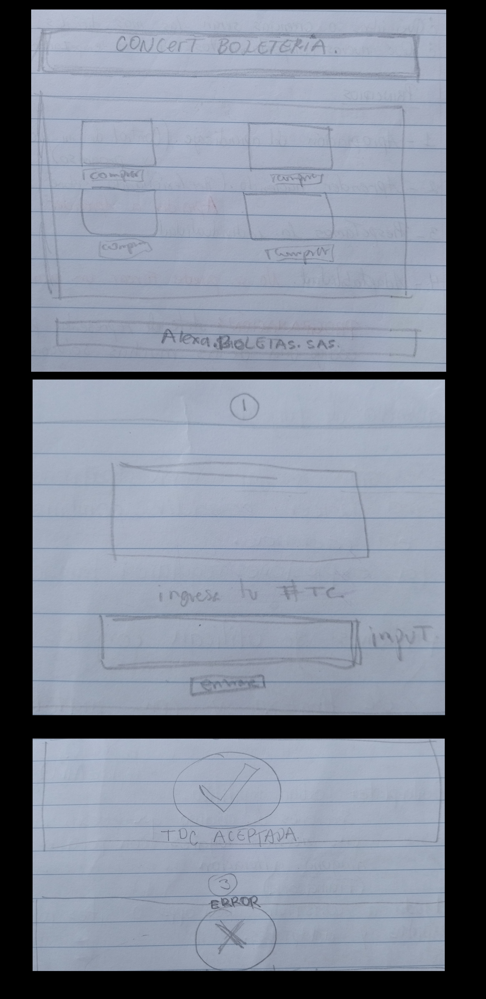

# Tarjeta de crédito válida Para Cine Boletería

## Índice

* [1. Resumen](#1-resumen)
* [2. Imagen Final del proyecto](#4-Imagen-FInal)
* [3. Investigación UX ](#3-experiencia-usuarios)

***

## 1. Resumen

Este proyecto se basa en un plataforma para validar TC al momento de pagar
el boleto de una pelicula en Cine Boletería.

## 2. Imagen del proyecto
[Imagen FInal Proyecto](src/Img/Captura%20de%20pantalla%20(501).png)

## 3. investigación UX

Esta pagina va dirigida a usuarios amantes de peliculas antiguas que desean disfrutar de sus peliculas preferidas en la pantalla grande y en pro de ahorrar tiempo a la hora de comprar sus boletos pueden hacerlo a traves de esta plataforma.

